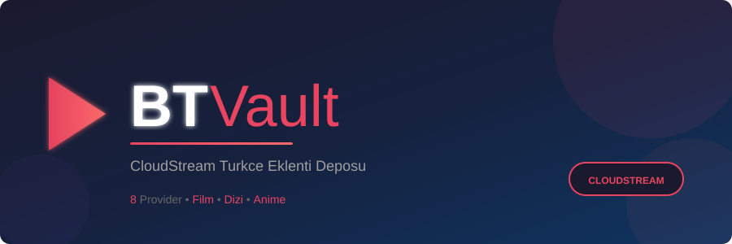

<p align="center">
  
</p>

<h1 align="center">BTVault</h1>

<p align="center">
  <strong>CloudStream Turkce Eklenti Deposu</strong><br>
  Film, dizi, anime ve belgesel platformlari icin tek depo.
</p>

<p align="center">
  <a href="cloudstreamrepo://raw.githubusercontent.com/baristomruk-max/BTVault/main/repo.json">
    
  </a>
  <a href="https://github.com/recloudstream/cloudstream/releases/tag/pre-release">
    
  </a>
  <a href="https://github.com/baristomruk-max/BTVault">
    
  </a>
</p>

---

## Tek Tikla Kurulum

> **Telefonunuzdan asagidaki butona tiklayin, CloudStream otomatik olarak acilacak ve depoyu ekleyecektir.**

<p align="center">
  <a href="cloudstreamrepo://raw.githubusercontent.com/baristomruk-max/BTVault/main/repo.json">
    
  </a>
  <sub>*(CloudStream uygulamasını açar ve repoyu otomatik ekler)*</sub>
</p>

### Manuel Kurulum

1. [CloudStream Pre-Release](https://github.com/recloudstream/cloudstream/releases/tag/pre-release) APK'sini indirip kurun
2. Uygulamada **Ayarlar > Eklentiler > Depo Ekle** bolumune gidin
3. **"URL" fieldsine tam olarak asagidaki linki kopyalayip yapistirin:**

```
https://raw.githubusercontent.com/baristomruk-max/BTVault/main/repo.json
```

> **ÖNEMLİ:** Sadece `BTVault` veya `baristomruk-max` yazmayin! Tam URL'yi kopyalayip yapistirmelisiniz. Aksi takdirde "geçersiz veri" hatası alacaksınız.

4. "Depoyu Adı" fieldsine `BTVault` yazabilirsiniz veya bunu boş bırakabilirsiniz.
5. "Tamam" veya "Ekle"'a tiklayin.

---

## Icerik

> **41 eklenti - 27 aktif, 1 beta, 13 site kapali.**
>
> - ✅ Aktif: site acik, eklenti bu adreste calisiyor
> - 🟡 Beta: eklenti henuz tam test edilmedi
> - ⚠️ Cloudflare: site Cloudflare korumali, uygulama ici dogrulama gerekebilir
> - ⏳ Kaynak gecici olarak yanit vermiyor (site ayakta, sunucu sorunu)
> - 🔴 Site kapali / adresi yok: kod repoda duruyor, yeni adres bulununca tekrar aktif olacak

<table>
  <tr>
    <th>Platform</th>
    <th>Tur</th>
    <th>Durum</th>
  </tr>
  <tr><td>🎭 <strong>AnimeciX</strong></td><td>Anime</td><td>✅ Aktif</td></tr>
  <tr><td>🌍 <strong>BelgeselX</strong></td><td>Belgesel</td><td>✅ Aktif</td></tr>
  <tr><td>📡 <strong>CanliTV</strong></td><td>Canli TV</td><td>🔴 M3U listesi kaldirildi</td></tr>
  <tr><td>🧸 <strong>CizgiMax</strong></td><td>Cizgi Film</td><td>✅ Aktif</td></tr>
  <tr><td>📺 <strong>DiziBox</strong></td><td>Yabanci Dizi</td><td>⚠️ Cloudflare korumali</td></tr>
  <tr><td>🌸 <strong>DiziKorea</strong></td><td>Kore Dizi</td><td>⏳ Kaynak su an yanit vermiyor</td></tr>
  <tr><td>📺 <strong>Dizilla</strong></td><td>Yabanci Dizi</td><td>✅ Aktif (dizilla.club)</td></tr>
  <tr><td>📺 <strong>DiziMom</strong></td><td>Yerli + Yabanci Dizi</td><td>✅ Aktif (dizimom.com)</td></tr>
  <tr><td>📺 <strong>DiziPal</strong></td><td>Dizi & Film</td><td>🔄 Domain donerli (1219+)</td></tr>
  <tr><td>📺 <strong>DiziYou</strong></td><td>Yabanci Dizi</td><td>✅ Aktif (diziyou.com)</td></tr>
  <tr><td>🎬 <strong>FilmMakinesi</strong></td><td>Film</td><td>✅ Aktif (filmmakinesi.to, yeni tema guncellendi)</td></tr>
  <tr><td>🎬 <strong>FilmModu</strong></td><td>Film</td><td>✅ Aktif (filmmodu.nl)</td></tr>
  <tr><td>🎬 <strong>FullHDFilm</strong></td><td>Film</td><td>🔴 Adresi yok</td></tr>
  <tr><td>🎬 <strong>FullHDFilmizlesene</strong></td><td>Film</td><td>✅ Aktif (fullhdfilmizlesene.now)</td></tr>
  <tr><td>🔞 <strong>FullPorner</strong></td><td>Yetiskin (VPN)</td><td>✅ Aktif</td></tr>
  <tr><td>📡 <strong>GolgeTV</strong></td><td>Canli TV</td><td>🔴 API adresi yok</td></tr>
  <tr><td>🎬 <strong>HDFilmCehennemi</strong></td><td>Film & Dizi</td><td>✅ Aktif</td></tr>
  <tr><td>🔞 <strong>HQPorner</strong></td><td>Yetiskin (VPN)</td><td>✅ Aktif</td></tr>
  <tr><td>🎬 <strong>InatBox</strong></td><td>Film, Dizi, Canli</td><td>🟡 Beta</td></tr>
  <tr><td>🎬 <strong>IzleAI</strong></td><td>Film</td><td>✅ Aktif</td></tr>
  <tr><td>🎬 <strong>JetFilmizle</strong></td><td>Film</td><td>✅ Aktif</td></tr>
  <tr><td>🌸 <strong>KoreanTurk</strong></td><td>Kore Dizi</td><td>⏳ Kaynak su an yanit vermiyor</td></tr>
  <tr><td>🎬 <strong>KultFilmler</strong></td><td>Film & Dizi</td><td>✅ Aktif (yeni tema guncellendi)</td></tr>
  <tr><td>🎬 <strong>NetflixMirror</strong></td><td>Film & Dizi</td><td>🔴 iosmirror.cc kapandi</td></tr>
  <tr><td>🔞 <strong>OxAx</strong></td><td>Yetiskin (VPN)</td><td>🔴 Servis kapandi</td></tr>
  <tr><td>🔞 <strong>PornHub</strong></td><td>Yetiskin (VPN)</td><td>✅ Aktif</td></tr>
  <tr><td>🎬 <strong>RareFilmm</strong></td><td>Film</td><td>✅ Aktif</td></tr>
  <tr><td>📡 <strong>RecTV</strong></td><td>Film + Canli TV</td><td>🔴 Adresi yok</td></tr>
  <tr><td>🎬 <strong>SetFilmIzle</strong></td><td>Film & Dizi</td><td>🔴 Adresi yok</td></tr>
  <tr><td>📺 <strong>SezonlukDizi</strong></td><td>Yabanci Dizi</td><td>✅ Aktif (sezonlukdizi.cc, yeni tema guncellendi)</td></tr>
  <tr><td>🎬 <strong>SinemaCX</strong></td><td>Film</td><td>🔴 Adresi yok</td></tr>
  <tr><td>🎬 <strong>SineWix</strong></td><td>Film, Dizi, Anime</td><td>🔴 Servis kapandi</td></tr>
  <tr><td>🔞 <strong>SpankBang</strong></td><td>Yetiskin (VPN)</td><td>⚠️ Cloudflare korumali</td></tr>
  <tr><td>🎬 <strong>SuperFilmGeldi</strong></td><td>Film</td><td>🔴 Adresi yok</td></tr>
  <tr><td>🎭 <strong>TurkAnime</strong></td><td>Anime</td><td>🔴 Site resmen kapandi (2010-2026)</td></tr>
  <tr><td>🎬 <strong>UgurFilm</strong></td><td>Film</td><td>🔴 Adresi satilik</td></tr>
  <tr><td>🔞 <strong>UncutMaza</strong></td><td>Yetiskin (VPN)</td><td>⚠️ Cloudflare korumali</td></tr>
  <tr><td>🎬 <strong>Watch2Movies</strong></td><td>Film</td><td>🔴 Adresi yok</td></tr>
  <tr><td>🎬 <strong>WebteIzle</strong></td><td>Film</td><td>⚠️ Cloudflare korumali (webteizle.info)</td></tr>
  <tr><td>🔞 <strong>xHamster</strong></td><td>Yetiskin (VPN)</td><td>✅ Aktif</td></tr>
  <tr><td>▶️ <strong>YouTube</strong></td><td>Video</td><td>✅ Aktif (Invidious)</td></tr>
</table>

---

## Son Guncellemeler (25.09.2026)

- **Kekik Akademi deposundan 33 yeni eklenti port edildi** (paket adi `com.keyiflerolsun` -> `com.btcozum.btvault`).
- **KultFilmler** tamamen yeni temaya gore yazildi: `a.mcard` kartlari, `h1.vtitle`, `script#kf-srcdata` JSON kaynak listesi.
- **SezonlukDizi** `sezonlukdizi.cc` adresine tasinip yeni `div.afis` kart yapilandirmasina gore guncellendi, arama Cloudflare korumasi icin `CloudflareKiller` eklendi.
- **FilmMakinesi** `filmmakinesi.to` adresine tasinip yeni tur/sure/oyuncu alanlari ve `video-parts` oynatici yapilandirmasi ile guncellendi.
- **Domain guncellemesi:** Dizilla (`.club`), DiziYou (`.com`), DiziMom (`.com`), FilmModu (`.nl`), FullHDFilmizlesene (`.now`), WebteIzle (`.info`).
- **13 eklenti `status = 0` (kapali)** olarak isaretlendi; site adresi bulunur olcur tekrar aktif edilebilir.
- `check-sites.ps1` / `verify-sel.ps1` ile **yasi adres ve selector dogrulama** scriptleri eklendi (bkz. `Gelistirme`).

---

## Ozellikler

- 🔍 **Tek Arama** - Tum platformlarda ayni anda arama
- 📥 **Indirme** - Filmleri ve dizileri cevirime indirin
- 📱 **TV Desteği** - Android TV ve tabletlerde calisir
- 🔄 **Otomatik Guncelleme** - Yeni bolumler otomatik eklenir
- 🎬 **Kiralama Modu** - Chromecast ile televizyona aktarin

---

## Yeni Eklenti Ekleme

```bash
# 1. Bu repoyu fork edin
# 2. Yeni klasor olusturun
mkdir YeniPlatform

# 3. Gerekli dosyalari olusturun
# - build.gradle.kts (metadata)
# - src/main/AndroidManifest.xml
# - src/main/kotlin/com/btcozum/btvault/YeniPlatformPlugin.kt
# - src/main/kotlin/com/btcozum/btvault/YeniPlatform.kt

# 4. Push edin, GitHub Actions otomatik derler
git push origin main
```

---

## Gelistirme

```bash
# Yerel derleme
.\gradlew.bat FilmMakinesi:make

# Tek provider derleme
.\gradlew.bat HDFilmCehennemi:make

# Tum provider'lari derleme
.\gradlew.bat make

# plugins.json uret
.\gradlew.bat makePluginsJson
```

### Canli dogrulama scriptleri

Depo kokundeki scriptler her provider'in ana adresini Google DNS (8.8.8.8) uzerinden
cozup canli olarak ceker, sonra kullanilan CSS selector'lerin hala sayfada olup olmadigini kontrol eder.
(Yerel router DNS'i bir cok streaming alan adini 195.175.254.2'ye yonlendirdigi icin Google DNS kullanilir.)

```powershell
.\check-sites.ps1    # her provider'in ana adresi -> HTTP durumu, baslik, HTML
.\verify-sel.ps1     # kod icindeki selector'lerin ana sayfada kacisi var
```

---

## Tesekkurler

| | Proje |
|---|---|
| 🙏 | [KekikAkademi](https://github.com/keyiflerolsun/Kekik-cloudstream) - Kaynak provider kodlari |
| 🙏 | [CloudStream](https://github.com/recloudstream/cloudstream) - Uygulama |
| 🙏 | [recloudstream](https://github.com/recloudstream) - Topluluk |

---

<p align="center">
  <sub>BTVault &copy; 2026 | <a href="https://github.com/baristomruk-max">baristomruk-max</a> | GPL-3.0</sub>
</p>
