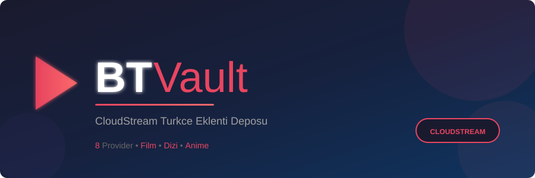

<p align="center">
  
</p>

<h1 align="center">BTVault</h1>

<p align="center">
  <strong>CloudStream Turkce Eklenti Deposu</strong><br>
  Film, dizi, anime ve belgesel platformlari icin tek depo.
</p>

<p align="center">
  <a href="cloudstreamrepo://raw.githubusercontent.com/baristomruk-max/BTVault/main/repo.json">
    
  </a>
  <a href="https://github.com/recloudstream/cloudstream/releases/tag/pre-release">
    
  </a>
  <a href="https://github.com/baristomruk-max/BTVault">
    
  </a>
</p>

---

## Tek Tikla Kurulum

> **Telefonunuzdan asagidaki butona tiklayin, CloudStream otomatik olarak acilacak ve depoyu ekleyecektir.**

<p align="center">
  <a href="cloudstreamrepo://raw.githubusercontent.com/baristomruk-max/BTVault/main/repo.json">
    
  </a>
  <sub>*(CloudStream uygulamasını açar ve repoyu otomatik ekler)*</sub>
</p>

### Manuel Kurulum

1. [CloudStream Pre-Release](https://github.com/recloudstream/cloudstream/releases/tag/pre-release) APK'sini indirip kurun
2. Uygulamada **Ayarlar > Eklentiler > Depo Ekle** bolumune gidin
3. **"URL" fieldsine tam olarak asagidaki linki kopyalayip yapistirin:**

```
https://raw.githubusercontent.com/baristomruk-max/BTVault/main/repo.json
```

> **ÖNEMLİ:** Sadece `BTVault` veya `baristomruk-max` yazmayin! Tam URL'yi kopyalayip yapistirmelisiniz. Aksi takdirde "geçersiz veri" hatası alacaksınız.
>
> **Kısa kod neden çalışmaz?** CloudStream'in kısa kod özelliği bir depo özelliği değildir: tek kelime yazdığınızda uygulama `https://cutt.ly/<kod>` (veya `!<kod>` ile `https://py.md/<kod>`) adresine istek atıp yönlendirme (`Location`) başlığını arar. `cutt.ly/btvault` ve `cutt.ly/baristomruk-max` **404** dönüyor, yani o kısa linkler hiç oluşturulmamış. Kısa kod kullanılabilmesi için `btvault` adına bir cutt.ly kısa linki (ücretsiz hesapla) oluşturulmalı; o olmadan **yalnızca tam URL** çalışır. Alternatif olarak yukarıdaki rozetten tıklayıp `cloudstreamrepo://...` bağlantısını da kullanabilirsiniz.

4. "Depoyu Adı" fieldsine `BTVault` yazabilirsiniz veya bunu boş bırakabilirsiniz.
5. "Tamam" veya "Ekle"'a tiklayin.

---

## Icerik

> **22 eklenti - hepsi aktif.**
>
> - ✅ Aktif: site acik, eklenti bu adreste calisiyor

<table>
  <tr>
    <th>Platform</th>
    <th>Tur</th>
    <th>Durum</th>
  </tr>
  <tr><td>🎭 <strong>AnimeciX</strong></td><td>Anime</td><td>✅ Aktif</td></tr>
  <tr><td>🌍 <strong>BelgeselX</strong></td><td>Belgesel</td><td>✅ Aktif</td></tr>
  <tr><td>🧸 <strong>CizgiMax</strong></td><td>Cizgi Film</td><td>✅ Aktif (yeni tema guncellendi)</td></tr>
  <tr><td>📺 <strong>DiziBox</strong></td><td>Yabanci Dizi</td><td>✅ Aktif (dizibox.live, v17 - tarayici basliklari eklendi)</td></tr>
  <tr><td>📺 <strong>Dizilla</strong></td><td>Yabanci Dizi</td><td>✅ Aktif (dizilla.now, v16 - Tailwind/Angular tema entegrasyonu)</td></tr>
  <tr><td>📺 <strong>DiziMom</strong></td><td>Yerli + Yabanci Dizi</td><td>✅ Aktif (dizimom.help, v12 - yeni tema uyumu)</td></tr>
  <tr><td>📺 <strong>DiziPal</strong></td><td>Dizi & Film</td><td>✅ Aktif (dizipal3008.com, filmvedizi temasi)</td></tr>
  <tr><td>📺 <strong>DiziYou</strong></td><td>Yabanci Dizi</td><td>✅ Aktif (diziyou.one)</td></tr>
  <tr><td>🎬 <strong>FilmMakinesi</strong></td><td>Film</td><td>✅ Aktif (filmmakinesi.to, v2 - CloseLoad/Rapid extractor eklentisi eklendi)</td></tr>
  <tr><td>🎬 <strong>FilmModu</strong></td><td>Film</td><td>✅ Aktif (filmmodu.one, v9 - schema.org microdata + lazy afis guncellemesi)</td></tr>
  <tr><td>🎬 <strong>FullHDFilmizlesene</strong></td><td>Film</td><td>✅ Aktif (fullhdfilmizlesene.now, v5 - kategori adresleri düzeltildi)</td></tr>
  <tr><td>🔞 <strong>FullPorner</strong></td><td>Yetiskin (VPN)</td><td>✅ Aktif</td></tr>
  <tr><td>🎬 <strong>HDFilmCehennemi</strong></td><td>Film & Dizi</td><td>✅ Aktif (v18 - degistirilmedi, calisiyor)</td></tr>
  <tr><td>🔞 <strong>HQPorner</strong></td><td>Yetiskin (VPN)</td><td>✅ Aktif</td></tr>
  <tr><td>🎬 <strong>IzleAI</strong></td><td>Film</td><td>✅ Aktif</td></tr>
  <tr><td>🎬 <strong>JetFilmizle</strong></td><td>Film</td><td>✅ Aktif (videopark.top worker API entegresi ile v20)</td></tr>
  <tr><td>🎬 <strong>KultFilmler</strong></td><td>Film & Dizi</td><td>✅ Aktif (yeni tema guncellendi)</td></tr>
  <tr><td>🔞 <strong>PornHub</strong></td><td>Yetiskin (VPN)</td><td>✅ Aktif</td></tr>
  <tr><td>🎬 <strong>RareFilmm</strong></td><td>Film</td><td>✅ Aktif</td></tr>
  <tr><td>📺 <strong>SezonlukDizi</strong></td><td>Yabanci Dizi</td><td>✅ Aktif (sezonlukdizi.cc, v2 - StreamRubyExtractor eklentisi)</td></tr>
  <tr><td>🔞 <strong>xHamster</strong></td><td>Yetiskin (VPN)</td><td>✅ Aktif</td></tr>
  <tr><td>▶️ <strong>YouTube</strong></td><td>Video</td><td>✅ Aktif (Invidious, otomatik instance)</td></tr>
</table>

---

## Son Guncellemeler (06.10.2026)

- **Canli denetim (06.10.2026):** 41 eklentinin tamami Google DNS (8.8.8.8) uzerinden tekrar cekildi. Sonuclar tabloya islendi:
  - **DiziBox** artik erisilebilir (200, gercek sayfa, VPN engeli yok) -> ✅ Aktif olarak guncellendi (v17 tarayici basliklari).
  - **FilmModu** domaini `filmmodu.one` olarak dogrulandi (README'de hala `filmmodu.nl` yaziyordu; kod zaten `.one` kullanıyordu).
  - **SetFilmIzle** + **SuperFilmGeldi** 200 donuyor ama govde bos (0 byte) -> olu siteler, 🔴 olarak kaldi.
  - **TurkAnime** 200 donuyor bos baslikla; **UgurFilm** park sayfasi; **SpankBang/UncutMaza/WebteIzle** 403 Cloudflare -> durumlar degismedi.
  - **YouTube (Invidious)** API'si calisiyor (`invidious.f5.si/api/v1/trending` -> 42KB JSON, bot engeli yok).
  - Ozet: **22 aktif, 3 Cloudflare korumali, 16 site kapali** (toplam 41).

- **Yerel Chrome (CDP) ile Dizilla ve DiziMom yeniden yazildi** (her iki site de kendi temasini tamamen degistirmis):
  - **Dizilla v16**: site Artik **Tailwind/Angular** tabanli. Eski `div.grid-cols-3 a` / `h2` / `data-src` secicileri **0 sonuc** donuyordu (ana sayfa bomboş). Yeni yapi: `<li class="hover-border-top"><a href="dizi/the-scandal">`; liste artik `a[href*='dizi/']` uzerinden, baslik `img[alt]` (" izle" atilir), afis `img[src]` ile aliniyor (href'ler `dizi/xxx` seklinde goreli). Arama: eski `POST /bg/searchcontent` ucu **tamamen yanlis** (IzleAI'den kopyalanmis) ve yeni temada sunucu tarafi arama yok -> `/arsiv` + `/yabanci-dizi-izle` sayfalari cekilip **istemci tarafinda filtreleniyor**. Dizi sayfasi: `h1` = "The Scandal izle", bolumler `/the-scandal-1-sezon-1-bolum`. Bolum sayfasindaki oynatici `div#playerLsDizilla > iframe[src="//four.pichive.online/iframe.php?v=…"]` -> protokol-relative adres `https:` ile normallestirilip kayitli `FourPichive` cozucusune veriliyor.
  - **DiziMom v12**: `div.single-item` / `div.categorytitle a` / `div.cat-img img` secicileri **kaldirilmis** (0 sonuc). Yeni yapi: `<div class="img"><a href="https://www.dizimom.help/diziler/<slug>/">`; liste `a[href*='/diziler/']` ile, baslik `img[alt]`, afis `data-src` (lazy) uzerinden. `div.episode-box` (70 adet) yapisi da degistigi icin bolum kutusu icindeki ilk bolum-disi link seciliyor.

- **9 kanal duzeltildi (DiziBox, Dizilla, DiziYou, DiziMom, FullHDFilmizlesene, FilmModu, JetFilmizle, SezonlukDizi, WebteIzle)**:
  - **DNS engeli olan eski domainler guncellendi.** Turkiye ISP'leri (orn. `195.175.254.2`) `dizilla.club`, `diziyou.com`, `dizimom.com` gibi adresleri park IP'sine yonlendiriyordu; uygulamada "Baglanti bulunamadi / ERROR_CODE_IO_BAD_HTTP_STATUS (2004)" veriyordu. Artik `dizilla.now`, `diziyou.one`, `dizimom.help` kullaniliyor (yeni adresler sistem DNS'inde dogru cozulunuyor, `cutt.ly` yonlendirmesine de gerek kalmadi).
  - **FilmModu v9**: kategori yolu `/hd-film-kategori/*` -> `/film-tur/*` degisti; `?page=1` bos sayfa dondugu icin sayfalama duzeltildi; `load()` artik `div.titles`/`div.description` yerine **schema.org microdata** (`h1[itemprop=name]`, `[itemprop=description]`, `[itemprop=actor]`, `[itemprop=ratingValue]`) okuyor (eski kod `h1` bulamadigi icin "Error loading" veriyordu); afisler `data-src` (lazy) icinden aliniyor.
  - **FullHDFilmizlesene v5**: tum kategori adresleri 404 veriyordu; yenilendi (`/filmizle/aksiyon-filmleri` gibi), sayfalama `/slug` + `/slug/2` sekline getirildi, `loadLinks` artik `scx = {...}` yazan dogru scripti ariyor.
  - **JetFilmizle v20**: `videopark.top` sayfasi `WORKER_BASE` yerine `WORKER_URL` kullanmaya basladi ve `/v/<id>/info` yerine `/api/video?id=<id>` ucu geldi; cozucu guncellendi (HLS `hlsSource.file` + `mp4Sources`).
  - **SezonlukDizi v2 + WebteIzle v16**: bu kanallarin kaynaklarindan biri **StreamRuby (rubyvidhub.com)** ve CloudStream cekirdeginde bu host icin cozucu **yok**; `StreamRubyExtractor` eklendi (paketlenmis sayfa `getAndUnpack` ile acilip `sources:[{file:...master.m3u8}]` okunuyor) ve WebteIzle'nin oynatici tespitine `streamruby|rubyvidhub|megacloud` eklendi.
  - **DiziBox**: site tamamen Cloudflare bot korumasinda; tum isteklere tarayici benzeri `Accept` / `Accept-Language` / `Upgrade-Insecure-Requests` basliklari eklendi. **Yerel Chrome ile dogrulandiginda sitenin kendisinin VPN/sunucu IP'lerini engelledigi goruldu** (`::CLOUDFLARE_ERROR_1000S_BOX::` -> "VPN veya Server ip adresi ile giris yapmayiniz"). Bu kanal normal ev/mobil internetinde acilir, VPN/datacenter baglantisinda acilmaz; bu bir site tarafi engelidir, eklentiyle asilamaz.
- **Yerel Chrome (CDP) ile dogrulanan WebteIzle/SezonlukDizi zincirleri**: `scripts/` disinda `cdp_eval.ps1` ile gercek tarayici oturumunda `fetch()` calistirilip canli AJAX cevaplari alindi:
  - WebteIzle: `POST /ajax/dataAlternatif3.asp` -> `{"status":"success","data":[{"id":616107,"baslik":"Pixel"},{"id":616102,"baslik":"Ok.Ru"},{"id":616109,"baslik":"VidMoly"},{"id":616104,"baslik":"Filemoon"}]}`; `POST /ajax/dataEmbed.asp` -> `<script>vidmoly('7bfwh5jqhc3a','rv1')</script>`. Kodda **dil butonlari `src` degil `href` ile olcusuyordu** (`attr("src")` her zaman null -> "0 link" -> video acilmadi), duzeltildi.
  - SezonlukDizi: `POST /ajax/dataAlternatif22.asp` `dil=1` (Turkce) site tarafinda `"Bölüm henüz eklenmediği için yüklenemedi"` donuyor, `dil=0` (orijinal) 5 kaynak veriyor: **Pixel, Streamruby, Okru, VidMoly, Filemoon**; `dataEmbed22.asp` Streamruby icin `https://rubyvidhub.com/embed-3qi0lxffse5v.html` donuyor (yeni cozucunun canli testi basarili: `ucxipz…streamruby.net/…/master.m3u8`).

- **FilmMakinesi videolari acildi (v2)**: afisler/filmler geliyordu ama oynatici acilmiyordu. Sebep: FilmMakinesi kendi oynaticisini kullanıyor (`closeload.filmmakinesi.to` / `rapid.filmmakinesi.to`) ve bu host'lar icin CloudStream'de hazir extractor **yok**; `loadExtractor()` sessizce bos dönuyordu. Cozucu olarak `CloseLoadExtractor` + `RapidFMExtractor` eklendi (sabit degiskenli isimler, `eval(function(p,a,c,k,e,d))` packer, `fn("payload".split("*"))` obfuscation; `master.txt` olarak sunulan HLS `Referer` kontrolune takildigi icin `ExtractorLink.referer` ile gonderiliyor, altyazilar `tracks[]` uzerinden ayrilip geciyor). Film sayfasindaki `data-video_url` degerinin **YouTube fragman** oldugu icin filtrelendi. Dogrulama: `scripts/verify-filmmakinesi.ps1` (liste → film → embed → coz → `master.txt` 200 `#EXTM3U`) canli olarak **PASS** veriyor; cozucu 7/7 canli sayfada dogrulandi.

- **Tek tek canli denetim** yapildi: `scripts/audit.ps1` her eklentinin ana sayfa + arama ucunu Google DNS (8.8.8.8) uzerinden cekip karsilastirir; sonuclar asagidaki tabloya islendi.
- **HDFilmCehennemi arama duzeltildi**: `/search/?q=` adresi site tarafinda 404 donuyordu, kod `/search?q=` + `X-Requested-With: fetch` basligina cevrildi (5 sonuc donuyor).
- **CizgiMax yeni temaya gore yeniden yazildi**: ana sayfa `/arsiv/?page=N`, arama `/ara/?q=`, kartlar `div.film-item`, detay `anime-info-box` + `p.anime-desc`, bolum listesi `div.ep-grid-numbers`; oynatici icin sayfaya gomulu base64 `var servers` akisi port edildi.
- **YouTube Invidious ornegi degistirildi**: `inv.nadeko.net` API'yi kapatti (`403 Endpoint disabled`), artik sirayla denenen ornek listesi (`invidious.f5.si` vb.) ve `i.ytimg.com` kapak gorselleri kullaniliyor; DASH manifest de calisan ornekten aliniyor.
- **3 eklenti `status = 0`**: DiziKorea (526 Invalid SSL), KoreanTurk (522 Timeout), InatBox (`dizibox.rest` + `boxbc.sbs` backend DNS'de yok).
- **Kekik Akademi deposundan 33 yeni eklenti port edildi** (paket adi `com.keyiflerolsun` -> `com.btcozum.btvault`).
- **KultFilmler** tamamen yeni temaya gore yazildi: `a.mcard` kartlari, `h1.vtitle`, `script#kf-srcdata` JSON kaynak listesi.
- **SezonlukDizi** `sezonlukdizi.cc` adresine tasinip yeni `div.afis` kart yapilandirmasina gore guncellendi, arama Cloudflare korumasi icin `CloudflareKiller` eklendi.
- **FilmMakinesi** `filmmakinesi.to` adresine tasinip yeni tur/sure/oyuncu alanlari ve `video-parts` oynatici yapilandirmasi ile guncellendi.
- **Domain guncellemesi:** Dizilla (`.club`), DiziYou (`.com`), DiziMom (`.com`), FilmModu (`.nl`), FullHDFilmizlesene (`.now`), WebteIzle (`.info`).
- **13 eklenti `status = 0` (kapali)** olarak isaretlendi; site adresi bulunur olcur tekrar aktif edilebilir.
- `check-sites.ps1` / `verify-sel.ps1` ile **yasi adres ve selector dogrulama** scriptleri eklendi (bkz. `Gelistirme`).
- **`scripts/verify-search.ps1`** her arama ucunu canli cekip `search()` icindeki token'larin donen HTML/JSON'da olup olmadigini; **`scripts/verify-load.ps1`** ise ayni sonuc sayfalarindaki baglantilari takip edip detay + sezon sayfalarinda `load()` token'larini kontrol eder.
- **Arama ucunu dogrulama (25.09.2026):** 20 GET arama ucunden 18'i gecti (CizgiMax 3/3, HDFilmCehennemi 2/2, JetFilmizle 2/2, PornHub 1/1, xHamster 3/3, YouTube/AnimeciX JSON anahtarlari); SpankBang + WebteIzle Cloudflare 403 verdigi icin otomatik kontrol edilemiyor (uygulama ici `CloudflareKiller` devrede).
- **Detay sayfa dogrulamasi sonucu (25.09.2026):** CizgiMax 12/12, Dizilla 19/19, DiziMom 8/8, DiziYou 12/12, FilmMakinesi 12/12, FilmModu 8/8, FullHDFilmizlesene 12/12, FullPorner 11/11, HDFilmCehennemi 19/19, HQPorner 5/5, JetFilmizle 10/10, KultFilmler 17/17, PornHub 8/8, RareFilmm 7/7, xHamster 7/7; SezonlukDizi bu dogrulama sirasinda Cloudflare tarafindan engellendigi icin liste disinda kaldi (25.09.2026 guncellemesi sonrasi `scripts/verify-sezonlukdizi.ps1` 10/10 geciyor).
- **JetFilmizle tamamen yeniden yazildi**: `jetfilmizle.io` artik yalnizca tanitim sayfasi (`filmara.php` 405), gercek site `jetfilmizle.now`. Arama `GET /arama?q=`, liste `/filmler?page=N` + `div.film-card`, detay `#active-player` `data-film-*` alanlari + JSON-LD `genre`/`actor`, oynatici `POST /jetplayer` -> `<iframe>`; `videopark.top` embed'i `WORKER_BASE` + `VIDEO_ID` uzerinden `/v/<id>/info` (1080/720/360 mp4) olarak cozuluyor.
- **AnimeciX API szozlesmesi duzeltildi**: arama calisiyordu ama `load()` bos isim donduruyordu (`name` alani okunmuyordu), bolumler hic olusmuyordu (`videos` -> `data`, `episode_num` -> `episodeNumber` hatali) ve yil hep bos kaliyordu (`release_date` -> `releaseDate`). Artik `secure/videos/<id>` -> `tau-video.xyz/api/video/<embedId>` zinciri ile dogrudan mp4 kaliteleri cekiliyor.
- **PornHub `load()`** `data-label='Category'`/`'Pornstar'` secicileri kucuk harfe cevrilmis (`category`/`pornstar`) -> etiketler ve oyuncular bos donuyordu; `span.percent` artik client-side uretiliyor, `\"rating\":NN` JSON yedege alindi.
- **xHamster `load()`** `ul.root-8199e` gibi hash'li yardimci siniflar her front-end derlemesinde degistigi icin hep bos kaliyordu; `nav#video-tags-list-container a[href*=categories]` + `div.thumb-list--related div.thumb-list__item` ile degistirildi.
- **Dizilla `load()` onarildi**: `document.select("div.gap-3 span.text-sm")[1]` yeni next.js sayfasinda eleman bulamayinca `IndexOutOfBoundsException` firlatiyordu (butun detay sayfalari icin load() catliyordu) -> guvenli `getOrNull` cekilere alindi; ayrica ozet `meta[name=description]`, puan JSON-LD `ratingValue`, bolum kapagi `img[src*=images.macellan]` yedekleri eklendi.
- **IzleAI tamamen yeniden yazildi**: yeni temada eski secicilerin tamami kalmadi (`/kategori/*` 404, `a.ambilight` yok, `/bg/searchcontent` 404). Site artik AES-256-CBC ile sifreli `secureData` paketi uzerinden calisiyor: liste `POST /api/bg/findMovies` (`currentPage`, 24'er kayit), arama `POST /api/bg/searchContent?searchterm=`, detay `__NEXT_DATA__ -> props.pageProps.secureData`, kaynaklar `RelatedResults.getMoviePartSourcesById_* -> source_content -> pichive -> source2.php -> master.m3u8`. Cozucu `base64(sha256("!!22xx!!90!!")).substring(0,32)` anahtari ile yazildi; butun zincir `scripts/verify-izleai.ps1` ile canli dogrulaniyor.
- **BelgeselX yeni temaya gore yeniden yazildi**: `div.gen-movie-contain` / `h2.gen-title` secicileri tamamen kalkti. Ana sayfa `a.px-card` (sayfa 1 SSR, devami `/ajax_konukat.php?url=<slug>&page=N`, eski `&page=` eki kaldirildi), detay `h1.px-hero-title` + `meta[name=description]` + `span.px-imdb-genre-tag`, bolumler `a.px-ep-card` (`butonKaydet('id')` + `S<n> - B<m>` etiketi) ve `?epid=` ile izleme sayfasina baglandi; kaynaklar `diziGetir('id','ic1','ic2','ic3',...)` cagrilari ile `/video/data/<map>.php?id=<id>&sira=<1..3>` uclerine cevrilip icindeki jwplayer `file:` (mp4) veya `<iframe>` uzerinden cozuluyor. `scripts/verify-belgeselx.ps1` 4 adimin hepsini canli geciyor.
- **DiziBox oynatici zinciri onarildi**: `loadExtractor()` dogrudan `player/king/king.php` uzerine cagiriliyordu, bu adreste kayitli bir extractor oldugu icin hicbir kaynak bulunamiyordu. Simdi `div#video-area iframe` -> `player/*.php` -> icindeki gercek `<iframe>` cozuluyor: **molystream** icin AES'li `/embed/<id>` sayfasi yerine HLS ucu olan `/embed/sheila/<id>` dogrudan `M3U8` olarak ekleniyor (tarayici `User-Agent` + `Referer` sart, aksi halde 403/404), `moly.php` icindeki `atob(unescape(...))` karistirmasi cozulerek bulunan `vidmoly.biz` ve `haydi.php` -> `ok.ru` yansitilari `loadExtractor`'a veriliyor (cekirdekteki `Vidmolybiz` / `OkRuSSL` extractorlari ile). Ayrica kart basligi artik `h3 a`'dan okunuyor (ilk `<a>` afis linki oldugu icin arsivdeki 15/15 baslik bos kaliyordu), bolum numarasi regex'i `1.Sezon 1.Bolum` gibi isimlerle eslesecek sekilde duzeltildi, `?s=` arama sorgusu encode ediliyor ve interceptor 403 + `Just a moment` Cloudflare asamasini da yakaliyor. `scripts/verify-dizibox.ps1` eklendi (dizibox.live datacenter IP'ye 403 verdigi icin bu adimlar SKIP olur, molystream HLS + extractor kontrolleri calisir).
- **DiziPal tamamen yeniden yazildi**: eski tema (`diziler/son-bolumler`, `series-player-container`, `div#vast_new`, `search-autocomplete` API) tamamen kalkti, adres `dizipal3008.com` uzerindeki WordPress `filmvedizi` temasina tasinan. Liste/arama artik `div.post-item > a[href][title]` (+ `img[data-src]`) uzerinden, arama `/?s=<q>` ile, sayfalama `/diziler|filmler|animeler|platform/<x>|dizi-kategori/<x>|kategori/<x>/page/N/` (hepsi 200 + 30 kart). Dizi sayfasinda sezon listesi `#season-options-list -> /?sezon=N` ile **sunucu tarafinda** cekiliyor (ana sayfada yalnizca tek sezonun bolumleri duruyor), bolumler `div.episode-item` + `title="Dizi 1. Sezon 1. Bolum Izle"`. `loadLinks` -> `div.responsive-player iframe` -> gomulu oynatici (`Referer` sart, yoksa "referer gerekir") -> `fetch('/dl?op=get_stream&hash=...')` -> JSON `url`. `/dl` ucu yalnizca **`Origin: <gomulu oynatici orijini>`** ile cevap veriyor (yoksa `unauthorized`), HLS master/variant/segment ise hem `Origin` hem `Referer` istiyor (yoksa 403) - ikisi de `ExtractorLink` basliklarina yaziliyor; `subtitle:"[Turkce]..., [Ingilizce]..."` listesi `subtitleCallback`'e gonderiliyor. `scripts/verify-dizipal.ps1` zincirin 7 adimini da canli geciyor (dikkat: sistem DNS'i `x.ag2m4.cfd` icin park Cloudflare IP dondurdugu icin script `--resolve` ile Google DNS'e sabitliyor).
- **SezonlukDizi oynatici ve arama zinciri yenilendi**: `/ajax/dataAlternatif.asp` + `/ajax/dataEmbed.asp` uclari IIS 404'e dustu; yenileri `dataAlternatif22.asp` (`bid` + `dil` -> `[{id, baslik, kalite}]`, `id` artik sayisal) ve `dataEmbed22.asp` (`id` -> `<iframe src>`). Bazi alternatifler (Pixel) `/ajax/reCAPTCHADATA.asp` kapisi dondurdugu icin atlaniyor, `//` ile baslayan gomulu adresler `https:` ile tamamlaniyor; cozucu olarak jar'deki `Odnoklassniki`/`OkRu*`/`Vidmoly*`/`SibNet`/`FileMoon*` kullaniliyor (`rubyvidhub.com` - Streamruby - icin cozucu yok, o alternatif sessizce atlanir). Arama artik `POST /ajax/arama.asp` (`q=`) JSON'u ile calisiyor ve Cloudflare'den gecmiyor; eski `diziler.asp?adi=` sayfasi datacenter IP'ye 403 verdigi icin yedek olarak korundu. Kart (`div.afis a[href*='/diziler/']` + `img[data-src]` + `div.description`, sayfalama `&s=N`), dizi bilgisi (`div.header`, `div.image img[data-src]`, `div.extra content span` yil, `span#tartismayorum-konu`, `div.labels a[href*='tur']`, `... Dk.` sure), bolum tablosu (`table.unstackable` + td(2)=sezon / td(3)=bolum no / td(4)=bolum adi) ve oyuncu kartlari (`div.card` + `div.header` + `img`) birebir calisiyor; `scripts/verify-sezonlukdizi.ps1` zincirin 10 adimini da canli geciyor.

---

## Ozellikler

- 🔍 **Tek Arama** - Tum platformlarda ayni anda arama
- 📥 **Indirme** - Filmleri ve dizileri cevirime indirin
- 📱 **TV Desteği** - Android TV ve tabletlerde calisir
- 🔄 **Otomatik Guncelleme** - Yeni bolumler otomatik eklenir
- 🎬 **Kiralama Modu** - Chromecast ile televizyona aktarin

---

## Yeni Eklenti Ekleme

```bash
# 1. Bu repoyu fork edin
# 2. Yeni klasor olusturun
mkdir YeniPlatform

# 3. Gerekli dosyalari olusturun
# - build.gradle.kts (metadata)
# - src/main/AndroidManifest.xml
# - src/main/kotlin/com/btcozum/btvault/YeniPlatformPlugin.kt
# - src/main/kotlin/com/btcozum/btvault/YeniPlatform.kt

# 4. Push edin, GitHub Actions otomatik derler
git push origin main
```

---

## Gelistirme

```bash
# Yerel derleme
.\gradlew.bat FilmMakinesi:make

# Tek provider derleme
.\gradlew.bat HDFilmCehennemi:make

# Tum provider'lari derleme
.\gradlew.bat make

# plugins.json uret
.\gradlew.bat makePluginsJson
```

### Canli dogrulama scriptleri

`scripts/` altindaki scriptler her provider'in ana adresini Google DNS (8.8.8.8) uzerinden
cozup canli olarak ceker, sonra kullanilan CSS selector'lerin hala sayfada olup olmadigini kontrol eder.
(Yerel router DNS'i bir cok streaming alan adini 195.175.254.2'ye yonlendirdigi icin Google DNS kullanilir.)

```powershell
.\scripts\check-sites.ps1    # her provider'in ana adresi -> HTTP durumu, baslik, HTML
.\scripts\audit.ps1         # ana sayfa + arama ucunu canli cekip sonuc uretir
.\scripts\verify-sel.ps1     # kod icindeki selector'lerin ana sayfada kacisi var

# asama 2 - arama ucunu ve detay sayfayi canli dogrula
.\scripts\verify-search.ps1  # search() token'lari -> scripts/site-checks-search/
.\scripts\verify-load.ps1    # sonuc baglantisi -> detay/sezon sayfasi -> load() token'lari
.\scripts\check-tokens.ps1   # tek bir URL icin load() token raporu: -Url ... -Name ...

# asama 3 - tek tek eklenti zincir dogrulamasi (arama -> load -> loadLinks)
.\scripts\verify-izleai.ps1      # IzleAI      AES secureData + pichive zinciri
.\scripts\verify-belgeselx.ps1   # BelgeselX   diziGetir + /video/data/<map>.php
.\scripts\verify-dizibox.ps1     # DiziBox     player/*.php -> molystream HLS / vidmoly / ok.ru
.\scripts\verify-dizipal.ps1     # DiziPal     filmvedizi -> /dl (Origin) -> HLS
.\scripts\verify-sezonlukdizi.ps1 # SezonlukDizi  arama JSON + dataAlternatif22/dataEmbed22
```

`verify-load.ps1` film + dizi (sezon) sayfasini birlestirerek bakar; bazi seciciler
yalnizca dizi sayfasinda (`seasons`, `epsection`) ya da yalnizca film sayfasinda bulunur.
Kod icinde birebir yedek seciciler (`ccast`/`cm`, `mv-det-p`) `$allow` listesi ile isaretlidir.

---

## Tesekkurler

| | Proje |
|---|---|
| 🙏 | [KekikAkademi](https://github.com/keyiflerolsun/Kekik-cloudstream) - Kaynak provider kodlari |
| 🙏 | [CloudStream](https://github.com/recloudstream/cloudstream) - Uygulama |
| 🙏 | [recloudstream](https://github.com/recloudstream) - Topluluk |

---

<p align="center">
  <sub>BTVault &copy; 2026 | <a href="https://github.com/baristomruk-max">baristomruk-max</a> | GPL-3.0</sub>
</p>
